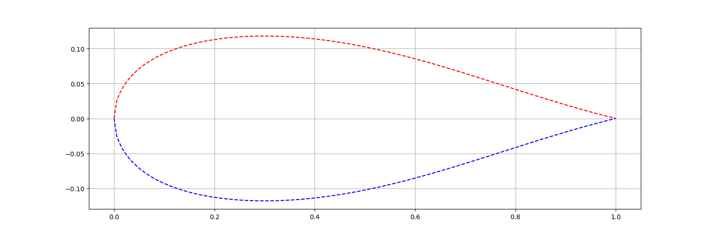

# libairfoil

Parametric Airfoils and Wings Library

## poetry

Install [Poetry](https://python-poetry.org/docs/#installation) as the package manager, then:

```
poetry install
```

to install the dependencies needed.

## unittests

```
poetry run pytest -s
```

## examples

```
poetry run parsec
```

Parsec-11 [0.01:0.4:0.075:-0.1:0.4:-0.075:0.1:0:0:0:20]


Parsec-11 [0.06:0.3:0.118:-0.9:0.3:-0.118:0.9:0:0:0:20]


