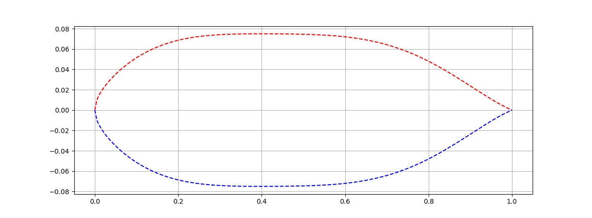

# libairfoil

Parametric Airfoils and Wings Library



## poetry

Install [Poetry](https://python-poetry.org/docs/#installation) as the package manager, then:

```
poetry install
```

to install the dependencies needed.

## examples

```
poetry run parsec
```

## unittests

```
poetry run pytest -s
```
